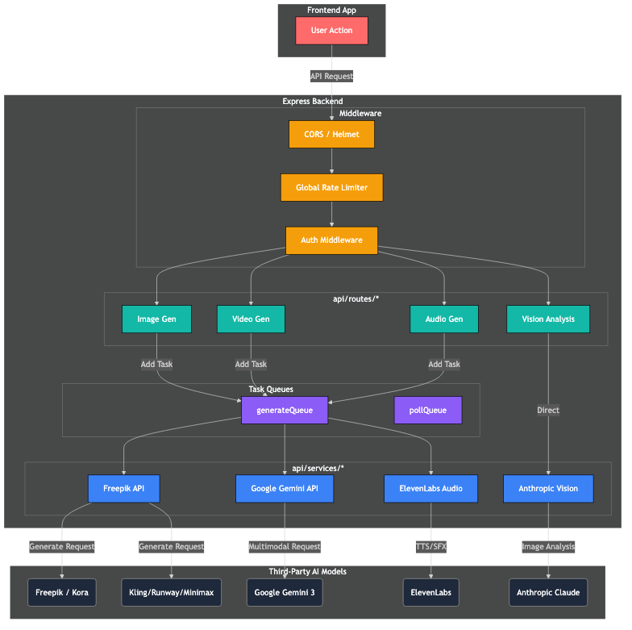
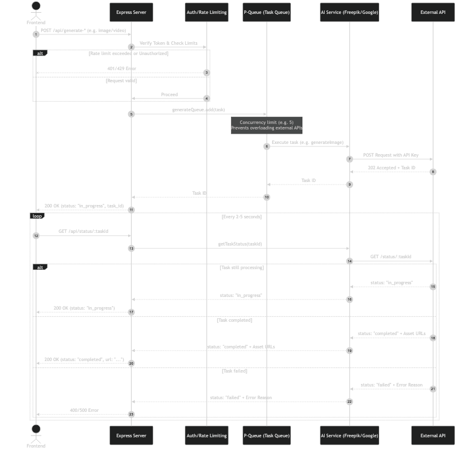

# Backend Userflow & Architecture

This document describes how user requests are processed by the Node.js Express backend.

## 1. High-Level Architecture Flow

When a user interacts with the canvas (e.g., executing a node), the request follows a structured pipeline through the backend:

1. **Express Middleware:** Requests pass through CORS, Helmet (Security Headers), and Global Rate Limiting.
2. **Routes:** Directed to specific endpoints in `api/routes/` based on the capability requested.
3. **Queueing:** To prevent rate limits from external APIs (like Freepik), long-running tasks are pushed to `generateQueue` (powered by `p-queue`).
4. **Services:** The queue delegates execution to `api/services/` which handle authentication and payload formatting for external AI providers.
5. **External APIs:** The 3rd-party models process the prompt and return either the generated asset or a task ID.

## 2. Sequence Diagram: Async Generation & Polling

Because generating AI assets (images, videos, audio) can take significant time, the backend employs an asynchronous Task ID and polling mechanism to prevent HTTP timeouts.

1. **Submit:** The user submits a generation request.
2. **Queue & Relay:** The backend queues the request and forwards it to the AI provider.
3. **Task ID:** The provider returns a `task_id` rather than the finished asset.
4. **Poll:** The frontend regularly polls `/api/status/:taskId`.
5. **Complete:** Once the provider marks the task as completed, the backend fetches the asset URLs and forwards them to the frontend.

