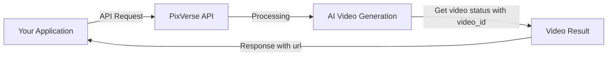

# How does the API work?

The PixVerse Platform API provides a straightforward way to generate videos from text prompts or images. This guide explains the core concepts and workflow of our API.

# API Architecture Overview

- The PixVerse API follows RESTful principles, making it easy to integrate with your applications. All API requests are made over HTTPS to ensure security, and data is exchanged in JSON format.


# Key Components
    1. Authentication: Every request requires an API key for authentication
    2. Endpoints: Specialized endpoints for different generation types
    3. Asynchronous Processing: Video generation occurs asynchronously
    4. Status Checking: Get video generation status to monitor generation progress
    5. Result Retrieval: Download links for completed videos
    

## Basic Workflow

1. Authentication
    - All requests must include in the header :
        - your **API key** for autentication
        - **A different Ai-trace-id** for each unique request (If you use the same ai-trace-id multiple times, You won't get a new video generated)
        - Other generation task requirements


2. Request Submission
    - Submit your generation request to the appropriate endpoint:
    - our request domain is https://app-api.pixverse.ai

:::highlight purple 💡
<Tabs>
  <Tab title="Text-to-video">
    1. Use Text-to-Video geneartion interface 
      https://docs.platform.pixverse.ai/text-to-video-generation-13016634e0
      
    2. According to parameter, please modify your value what you want
      https://docs.platform.pixverse.ai/api-parameter-description-803491m0
    <Container>
{
  "aspect_ratio": "16:9",
  "duration": 5,
  "model": "v3.5",
  "motion_mode": "normal",
  "negative_prompt": "string",
  "prompt": "string",
  "quality": "540p",
  "seed": 0,
  "water_mark": false
}
</Container>
  </Tab>
  <Tab title="Image-to-video">
      1. First you should uplaod image to get img_id for image-to-video function
      https://docs.platform.pixverse.ai/upload-image-13016631e0
      
      2. Use Image-to-video generation interface
      https://docs.platform.pixverse.ai/image-to-video-generation-13016633e0
      
      3. Accroding to parameter, please modify your value what you want
      <Container>
          {
  "duration": 5,
  "img_id": 0,
  "model": "v3.5",
  "motion_mode": "normal",
  "negative_prompt": "string",
  "prompt": "string",
  "quality": "540p",
  "seed": 0,
  "water_mark": false
}
      </Container>
    
    </Tab>
      <Tab title="Effects">
    1. First activate your effects
          https://docs.platform.pixverse.ai/how-to-use-effects-796054m0
    2. Fill in template_id in generation parameters to generate video
          - If you use text-to-video, we will reference the Prompt and generate the special effect.
          - If you use image-to-video, we will generate the special effect based on the uploaded image

  </Tab>
  <Tab title="Transition-generation">
    1. Upload 2 Images for first-last frame via https://docs.platform.pixverse.ai/upload-image-13016631e0
    2. Use Transition(First-last frame) Feature
      https://docs.platform.pixverse.ai/transitionfirst-last-frame-feature-15273513e0
  </Tab>
</Tabs>


:::


3. Response Handling
    - After submitting a request, you'll receive a response with video_id containing:

```
{
  "ErrCode": 0,
  "ErrMsg": "success",
  "Resp": {
    "video_id": 0
  }
}
```


4. Status Checking
    - Use the video_id to periodically check the status of your generation:
    - GET https://app-api.pixverse.ai/openapi/v2/video/result/{video_id}
    - https://docs.platform.pixverse.ai/get-video-generation-status-13016632e0


5. Result Retrieval
    - Once processing is complete, the status endpoint will return status **1**
 ```
    {
  "ErrCode": 0,
  "ErrMsg": "string",
  "Resp": {
    "create_time": "string",
    "id": 0,
    "modify_time": "string",
    "negative_prompt": "string",
    "outputHeight": 0,
    "outputWidth": 0,
    "prompt": "string",
    "resolution_ratio": 0,
    "seed": 0,
    "size": 0,
    "status": 1,
    "style": "string",
    "url": "string"
  }
}
 ```